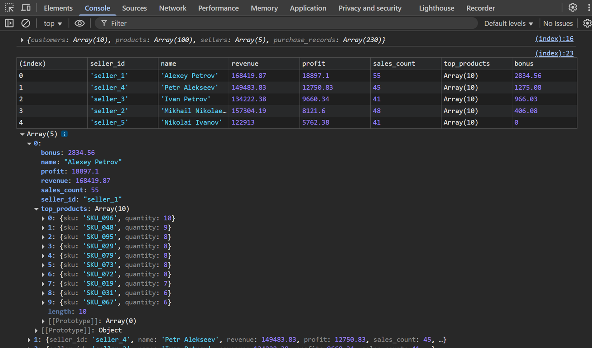

# Обработка данных продаж интернет-магазина, рассчет бонусов для продавцов и метрик для оценки их эффективности.

## Описание проекта
По собранным в датасете данным о продажах в магазине составлен рейтинг продавцов по доходности и рассчитаны бонусы для каждого продавца.

## Структура проекта
1. `data` - каталог с примерами данных
2. `src/main.js` - основной файл программы
3. `index.html` - файл для запуска программы

## Инструкция по запуску
Открыть любым способом файл `index.html` в браузере. В консоли DevTools (CTRL+Shift+I) будет выведен рейтинг продавцов и рассчитанные бонусы.

Чтобы изменить выбранный датасет, необходимо в файле `index.html` изменить ссылку в строке:
```html
<script src="data/dataset_1.js"></script>
```
Доступны 3 примера дата-сетов:
- `data/dataset_1.js`
- `data/dataset_2.js`
- `data/dataset_3.js`

<p align="center"></p>

# О проекте
- программа написана на чистом JS без использования сторонних библиотек;

- из основной функции анализа выделены функции для расчета прибыли и бонусов, что позволяет корректировать особенности расчетов без изменения основного кода;

- использованы только чистые функции (функция получает все что ей необходимо для работы через аргументы), не обращающиеся к глобальным переменным и не имеющие побочных эффектов;

- обработана входная структура данных и приведена к нужной промежуточной структуре для накопленной статистики по всем продавцам, из которой потом будет сформирован итоговый отчёт;

- при реализации бизнес логики с помощью метода forEach обновлена статистика в объекте для каждого продавца, методом sort отсортированы продавцы по убыванию и реализована функция расчёта бонусов, сформирован топ-10 продуктов при использовании метода slice.
